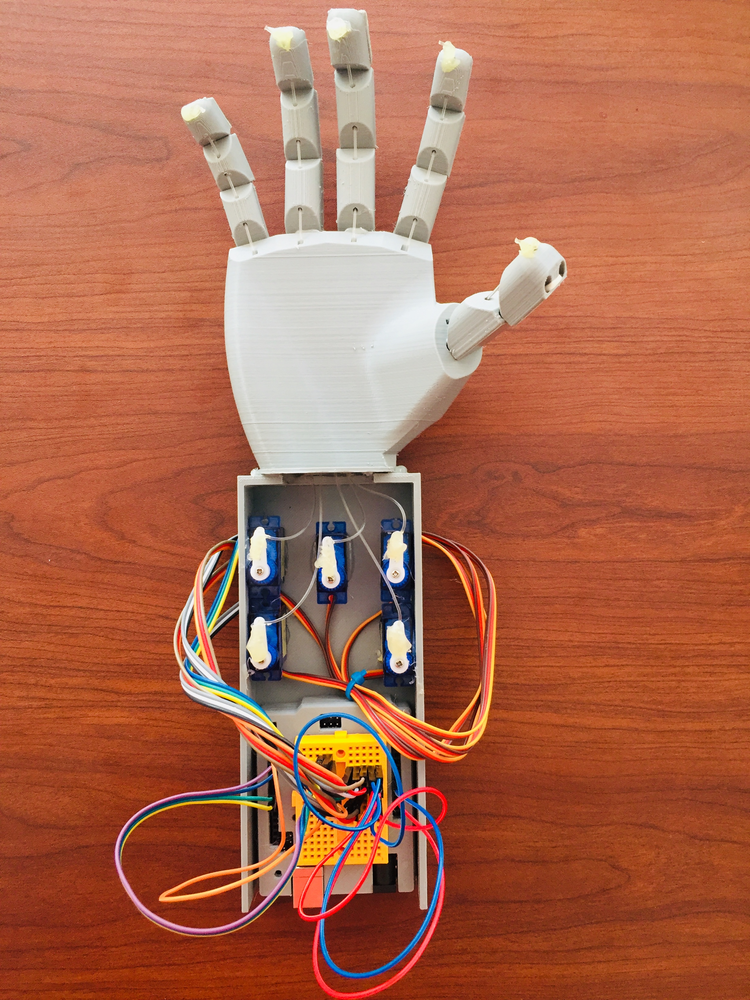

# Prosthetic Hand Basic Model

Although prosthetic hand technology is common in other countries, it is still a relatively new phenomenon in our country. It is difficult to produce due to a lack of technical capability. This is a pilot project designed to help people with special needs. The basic technology is used in this project.
 
We can further develop this and create a real prosthetic hand model.

At the same time, the project is seen as a model for 3D printing technology.Most of the parts found in it were made entirely with 3D printing technology

## Materials Needed
* Arduino
* servo motor
* Connecting wire
* Fishing line
* Ardunio power conector
 

**Author**
 * Jathujan Mahendran , Community Innovator at DreamSpace Academy.

**Acknowledgment**
 * Jerushan Sritharan , Guardian of Electronics Lab, DreamSpace Academy.
 * Rathees Koneswaran ,  Community Maker at DreamSpace Academy. 
 * Sajeev Punithakaran , Community Maker at DreamSpace Academy.
